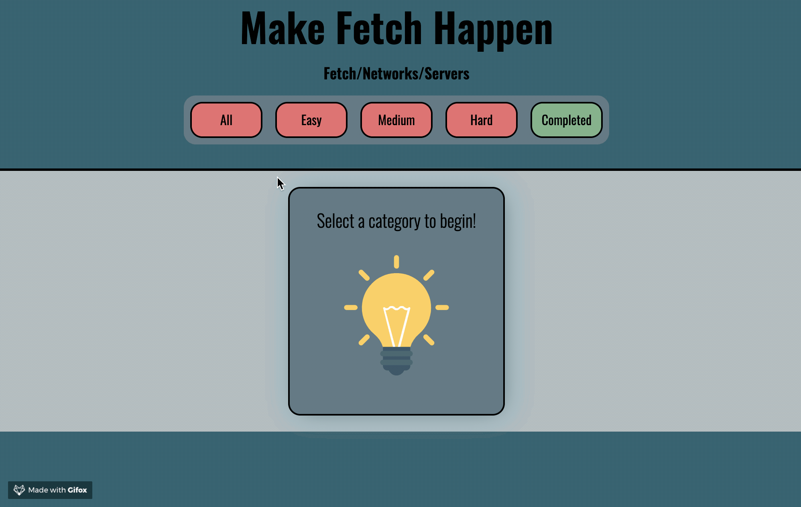
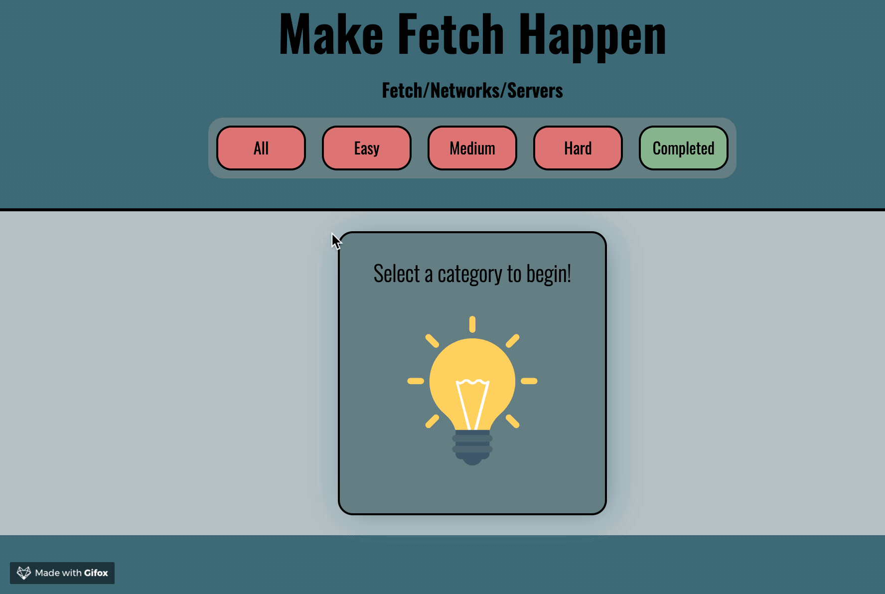

# Memoize, a flash card App to learn about Fetch
### By Rachael Drenann

This was a solo porject where we needed to use react, JSX, Sass/Scss, local storage, and Enzyme/Jest to demonstrate our mastery and understanding of the framework React

## What I gained from this project
In making this site, I gained a much better understanding on testing specifically. I learned what needs to be tested and how to ensure your app is working as you would expect.
### Screenshots
Favoriting a card and refreshing the page to check persistence:

Toggling through each category:

What you see once you complete all cards, requirement changed to 3 cards for this example:
)

In the project directory, you can run:

### `npm start`

Open [http://localhost:3000](http://localhost:3000) to view it in the browser.

The page will reload if you make edits. 
You will also see any lint errors in the console.

### `npm test`

Launches the test runner in the interactive watch mode. 
See the section about [running tests](https://facebook.github.io/create-react-app/docs/running-tests) for more information.

